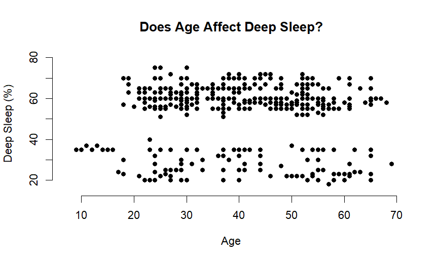
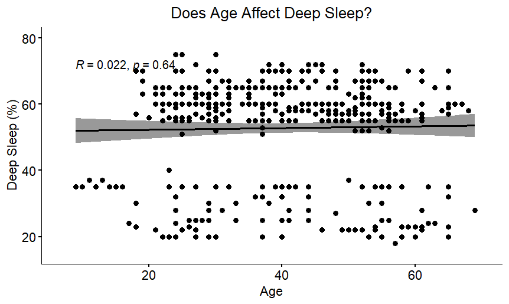
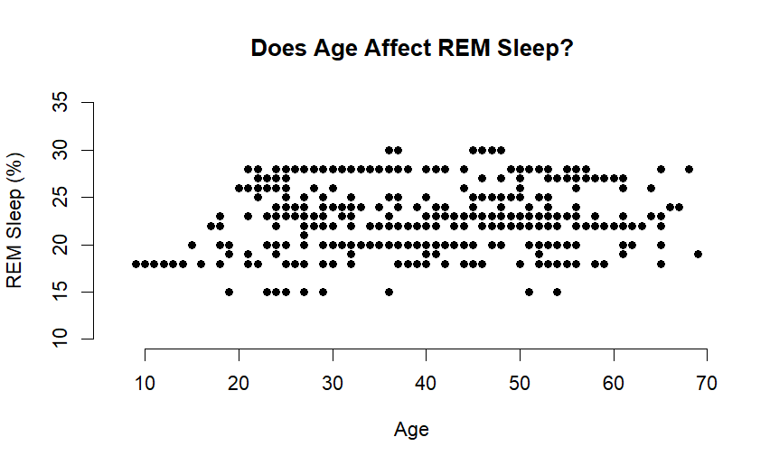
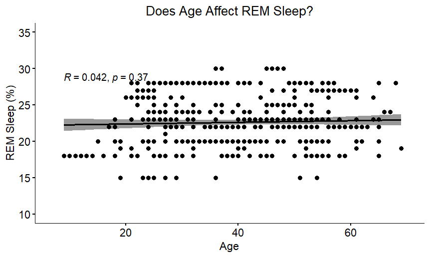
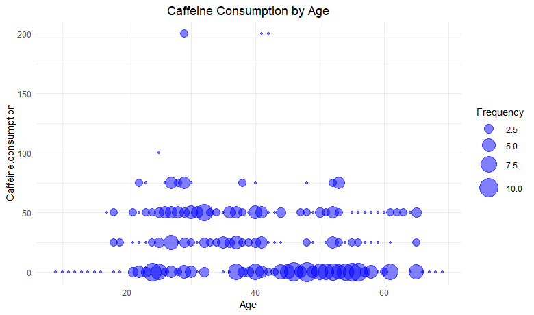
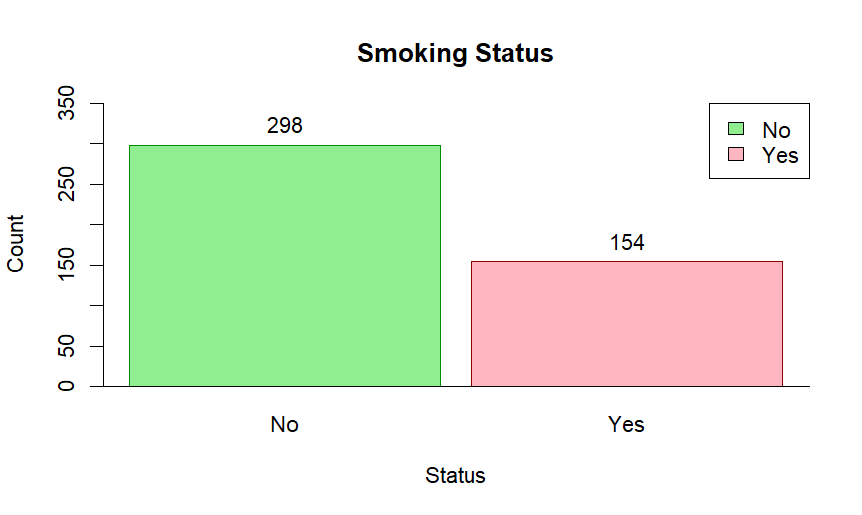
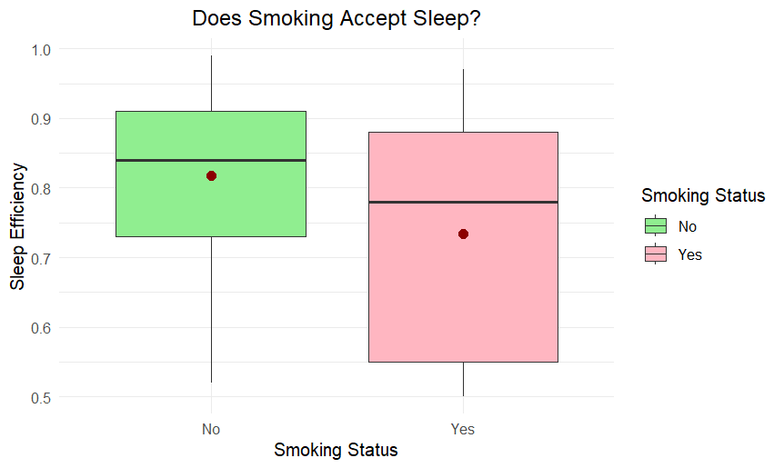
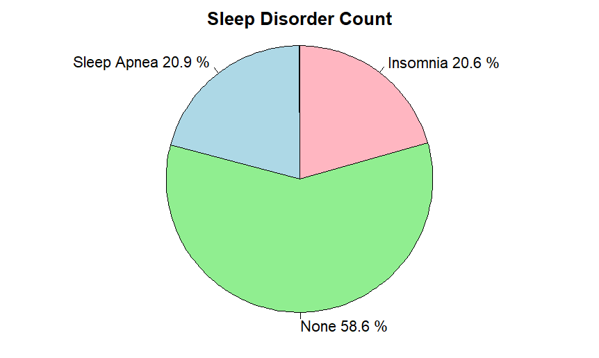
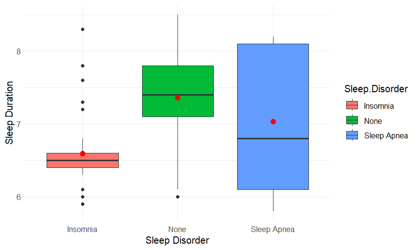

# CECS 450 - Semester Project 
Project Contributors: Holly Lee, Ivy Ly, Daniel Moreno

## Table of Contents
- [Project Goal](#project-goal)
- [Technology Used](#technology-used)
- [Datasets](#datasets)
- [Definitions](#definitions)
- [Findings](#findings)
- [Conclusion](#conclusion)

## Project Goal
For our semester project, we decided to take a look into the world of sleep! We are trying to find correlations between how different factors contribute to the quality of sleep people experience.
Our goal is to find the factors that greatly contribute to the greatest amount and quality of sleep so everyone can enjoy a good night's rest.

## Introduction

## Technology Used
- [R Language](https://cran.rstudio.com/)
- [RStudio](https://posit.co/download/rstudio-desktop/)
- [GitHub](https://github.com/)

## Datasets
We used the following datasets that can be found on Kaggle:

- [Sleep Efficiency](https://www.kaggle.com/datasets/equilibriumm/sleep-efficiency)
- [Sleep Health and Lifestyle](https://www.kaggle.com/datasets/uom190346a/sleep-health-and-lifestyle-dataset)

## Definitions
- Sleep Cycle- when the human body cycles through two phases of sleep: NREM and REM sleep. A person typically goes through 4-6 cycles per night, which starts over every 80- 100 minutes.

- NREM sleep- divided in stages (N1, N2, N3) varying in heartbeat, brain waves, eye movements, and breathing activity.

- REM sleep- a kind of sleep that occurs at intervals characterized by rapid eye movements, more dreaming, bodily movement, and faster pulse and breathing. 

- Caffeine consumption - the amount of caffeine consumed in the 24 hours prior to bedtime (in mg)

- Alcohol consumption - the amount of alcohol consumed in the 24 hours prior to bedtime (in oz). A standard drink in the United States contain 0.6 oz of pure alcohol. Which means a regular beer (12oz)  usually contain about 5% alcohol and a 5 ounces of table wine, typically contains about 12% alcohol.

- Insomnia - a sleep disorder characterized by difficulty falling asleep, staying asleep, or both. 

- Sleep Apnea - a condition that in which a person's breathing stops and restarts many times during sleep.

## Findings

### The Affect of Age on Sleep Cycle
Understanding the sleep cycle helps explain how certain factors can impact a person's sleep and health. In a typical night, a person goes through 4- 6 sleep cycles (not all the same length, avg. 90 minutes each). The first cycle is often the shortest, ranging from 70- 100 minutes, while later cycles tend to fall between 90- 120 minutes. Sleep cycles can vary from person to person and from night to night based on a wide range of factors. There are 4 sleep stages: 3 Non-REM (NREM) sleep and REM sleep.

Non-rapid eye movement (NREM) sleep is divided into stages and each vary in heartbeat, brain waves, eye movements, and breathing activity. N1 (light sleep) is the first stage of the sleep cycle when a person falls asleep, which last 1- 7 minutes. The body and brain activity slows down with brief movements. N2 enters a more subdued state including a drop in temperature, relaxed muscles, and slowed breathing and heart rate. Brain waves will show a new pattern and eye movement drops. Brain activity slows down, but short bursts of activity which help resist being woken up by external stimuli. Typically, it lasts 10-25 minutes during the first sleep cycle, and each N2 stage can become longer during the night. A person spends half the time in N2 sleep. N3 (deep sleep) is a phase where any environmental noises or activity may fail to wake the sleeping person. A person's muscle tone, pulse, and breathing rate decreases during this stage. Brain activity has an identifiable pattern of what are known as delta waves (deep, slow brain waves). Experts believe this stage is critical to restorative sleep, allowing for bodily recovery and growth. It may also bolster the immune system and other key bodily processes. Although brain activity is reduced, there is evidence that deep sleep contributes to insightful thinking, creativity, and memory. Normally, it will last 20-40 minutes; as a person continue to sleep, these stages get shorter, and more time gets spent in REM sleep.

Rapid eye movement (REM) sleep is the stage where most dreams occur. Brain activity is similar to when a person is awake. The body experiences atonia, which is temporary paralysis of the muscles, with two expectations: the eyes and the muscles that control breathing. This stage is essential to cognitive functions such as, memory, learning, and creativity. Normally, a person doesn't enter REM sleep until they have 90 minutes of sleep. This stage gets longer in the second half of the night. The first REM stage may only last only a few minutes, later stages can last around an hour. 

**Does Age Affect Light Sleep?**\
In the graph below, it displays a scatter plot relationship between a person's age and Light sleep measured in percentage. We are trying to test whether or not age affects the duration a person would spend in Light sleep. As we can see, the age varies from 9- 69 years old. Majority of the people would ~10- 27% in this stage, minority would ~40- 60%, and rarely no one ~30- 40% (one outlier). On average, an adult would spend ~50% in total in Light sleep. However, according the graph, the average light sleep is ~24.6%.

The graph below uses the pearson correlation coefficient formula to measure the linear correlation between age and light sleep percentage. Based on correlation coefficient calculation standards, the null hypothesis would be defined as age doesn't affect Light sleep, while the alternative hypothesis is age does affect Light sleep. The value of R is -0.032 which indicates it a weak, negative linear relationship between age and Light sleep percentage since the value is less than 0. The threshold of significance we chose to evaluate the p-value is 0.05. The p- value is 0.5 meaning that we accept the null hypothesis because it's greater than 0.05. In other words, we accept the fact that age has no effect on Light sleep. 

**Does Age Affect Deep Sleep?**\
In graph below, displays a scatter plot relationship between a person's age and Deep sleep measured in percentage. We are trying to test whether or not age affects the duration a person would spend in Deep sleep. As we can see, the age varies from 9- 69 years old. Majority of the people would ~50- 78% in this stage, minority would ~20- 40%, and no one ~40-50%. On average, an adult would spend between 15-25% in total in Deep sleep. However, according to the graph, the average deep sleep is ~52.8%.

The graph below uses the pearson correlation coefficient formula to measure the linear correlation between age and deep sleep percentage. Based on correlation coefficient calculation standards, the null hypothesis is age doesn't affect Deep sleep, while the alternative hypothesis is age does affect Deep sleep. From the calculation, the value of R is 0.022 which indicates it a weak, positive linear relationship between age and Deep sleep percentage since the value is greater than 0. The threshold of significance we chose to evaluate the p-value is 0.05. The p- value is 0.64 meaning that we accept the null hypothesis since it's greater than 0.05. In other words, we accept the fact that age has no effect on Deep sleep. 

**Does Age Affect REM Sleep?**\
The graph below, displays a scatter plot relationship between a person's age and REM sleep measured in percentage. We are trying to test whether or not age affects the duration a person would spend in REM sleep. As we can see, the age varies from 9- 69 years old, and the majority spend between 15- 30% in REM sleep. On average, an adult would spend 25% in total in REM sleep. According to the graph, the average is ~22.6% in REM sleep.

The graph below uses the pearson correlation coefficient formula to measure the linear correlation between age and rem sleep percentage. Based on correlation coefficient calculation standards, the null hypothesis would be age doesn't affect REM sleep, while the alternative hypothesis would be age does effect REM sleep. From the calculation, the value of R is 0.042 which indicates it a weak, positive linear relationship between age and REM sleep percentage since the value is greater than 0. The threshold of significance we chose to evaluate the p-value is 0.05. The p- value is 0.37 meaning that we accept the null hypothesis since it's greater than 0.05. In other words, we accept the fact that age has no effect on REM sleep. 

As mentioned earlier, most of the graphs indicate that age doesn't affect stages of the sleep cycle. However, there are a variety of factors that can influence a person's sleep cycle, so difficult to draw a reliable conclusion whether or not age affect on sleep efficiency given the limitation of the data.

###  Caffeine Consumption
**Does Caffeine Affect Sleep?**
In graph [1], we can see that although the majority of respondent does not drink coffee or any caffeine at all. People at age 25 - 40 drank 25mg to 75mg 24 hours prior to bed time. Lets see if caffeine consumption affect sleep efficiency.

Although caffeine consumption is believed to worsen sleep quality, our dataset shows differently. In graph [], the median of sleep efficiency decreased slightly from 0.82 to 0.80 at 0mg to 50mg caffeine consumption. At 75 to 200mg caffeine consumption, the median of sleep efficiency goes up to 0.8 - 0.9. However, as shown in graph [1], the data for caffeine consumption above 100 mg is relatively small, so it's difficult to draw firm conclusions about the relationship between caffeine consumption and sleep efficiency at these higher levels.
Therefore, given the limitations of the data, it is not possible to say definitively whether caffeine consumption has a positive or negative impact on sleep efficiency. 

### Alcohol Consumption

In graph [], it shows that alcohol consumption is more spread out than caffeine consumption. This means that there is a greater range of alcohol consumption within each age group, Additionally, the graph shows that there is a significant number of people in the 20-40 age group who drink 1 oz of alcohol in the 24 hours prior to bedtime, and a significant number of people in the 40-60 age group who consume 3oz of pure alcohol.

The graph [] shows that the sleep efficiency decreases as alcohol increases. The median sleep efficiency is 0.86 for people who consume 0 drinks per day, but it decreases to 0.82 for people who consume 1oz. The median decreases to 0.65 to 0.76 for people who consume more than 2oz. This suggests that drinking alcohol, even in moderate amounts, can disrupt sleep efficiency.

### Smoking Status 
The graph below shows a bar graph indicating the number people who smoke and don't smoke based on the data. As shown, the majority don't smoke with 298 people (66%), while around 154 people (34%) do smoke. 

The graph below represents 2 box and whisker plot to understand whether a person's smoking status affects their sleep efficiency. The smoking status variable indicates whether a person engages in this activity or not, while sleep efficiency is a measure of the proportion of time spent in bed that is actually spent asleep. We assume that people that don't smoke will have a higher sleep efficiency than those do smoke.

For the 'No' box and whisker plot, the minimum sleep efficiency value is 0.53, and the maximum sleep efficiency value is 0.99. The lower quartile is 0.73, while the upper quartile is 0.91. The median sleep efficiency is 0.84 for people who don't smoke. For the 'Yes' box and whisker plot, the minimum sleep efficiency value is 0.5, and the maximum sleep efficiency value is 0.97. The lower quartile is 0.55, while the upper quartile is 0.88. The median sleep efficiency is 0.78 for people who do smoke. Individuals who don't smoke had higher sleep efficiency in comparison to those who do smoke, which supports our claim. A limitation to this data is that we don't know how sleep efficiency is being measured.

## Sleep Disorder
In the pie chart below, it displays the percentage value of the sleep disorders found in the dataset. Around 20.6% appear to have insomnia, a sleep disorder characterize by difficulty falling asleep, staying asleep, or both. Around 20.9% have sleep apnea, a condition that in which a person's breathing stops and restarts many times during sleep. There are around 58.6% who don't have any sleep disorder. 

The box and whisker plot below, represents how each sleep disorder affects a person's sleep duration measured in hours.

For the 'Insomnia' box and whisker plot, the minimum sleep duration value is 6.3 hours, and the maximum sleep duration value is 6.75 hours. The lower quartile is 6.4 hours, while the upper quartile is 6.6 hours. The median sleep duration is 6.5 hours for people who have insomnia, which is significantly lower in comparison to the others. Some outliers were present on the graph. For the 'None' box and whisker plot, the minimum sleep duration value is 6.1 hours, and the maximum sleep duration value is 8.5 hours. The lower quartile is 7.1 hours, while the upper quartile is 7.7 hours. The median sleep duration is 7.4 hours for people who don't have a sleep disorder, which is higher compared to the others. There was an outlier present below the minimum sleep duration value. For the 'Sleep Apnea' box and whisker plot, the minimum sleep duration value is 5.3 hours, and the maximum sleep duration value is 8.2 hours. The lower quartile is 6.1 hours, while the upper quartile is 8.1 hours. The median sleep duration is 6.7 hours for people who have sleep apnea, which greater than the insomnia median but less than the none median. This suggest that sleep disorders can affect a person's sleep duration.

## Conclusion

## References
[Alcohol's Effects on Health](https://www.niaaa.nih.gov/alcohols-effects-health/overview-alcohol-consumption/what-standard-drink#:~:text=In%20the%20United%20States%2C%20one,which%20is%20about%2040%25%20alcohol)

[Sleep Cycle](https://www.sleepfoundation.org/stages-of-sleep)