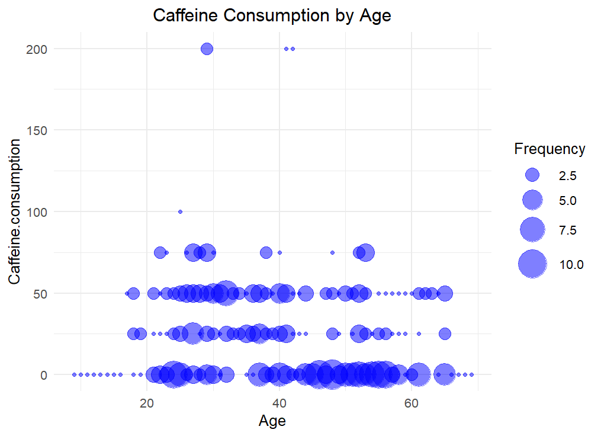
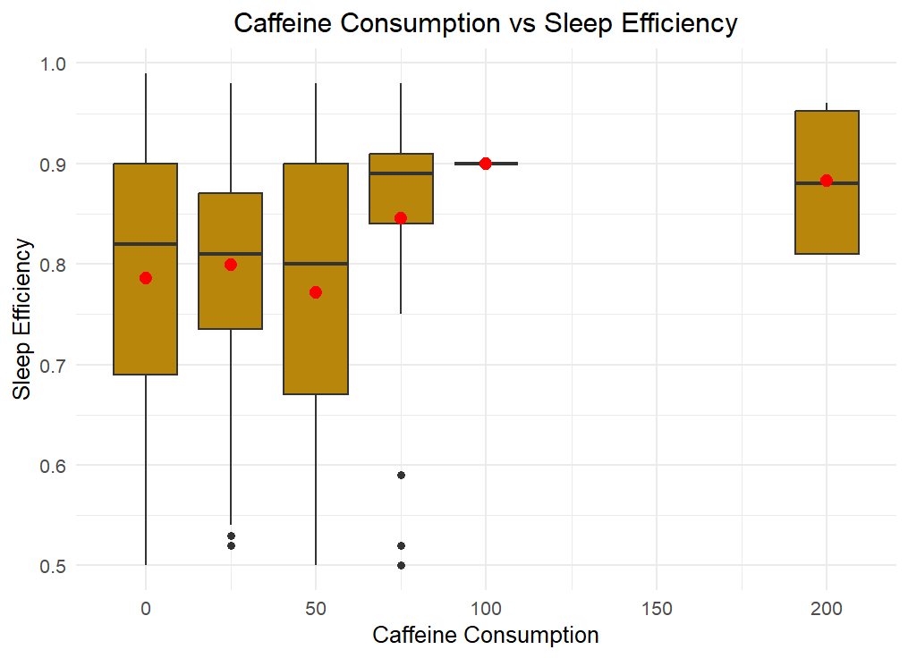
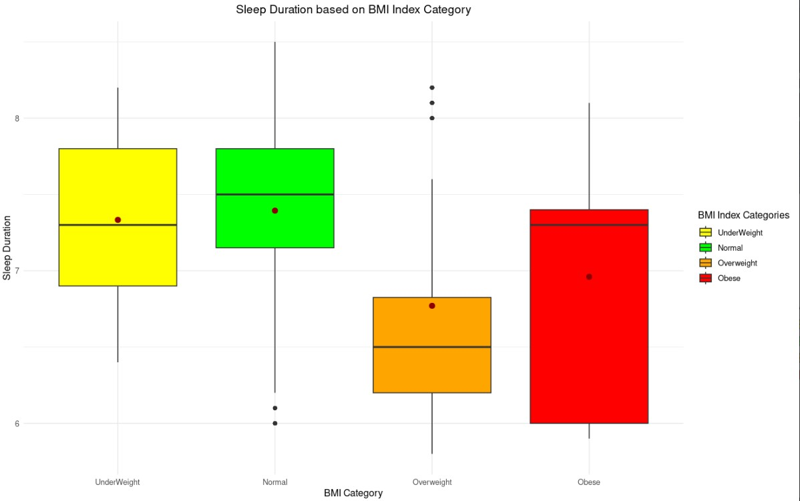

# CECS 450 - Semester Project 
Project Contributors: Holly Lee, Ivy Ly, Daniel Moreno

## Table of Contents
- [Project Goal](#project-goal)
- [Technology Used](#technology-used)
- [Datasets](#datasets)
- [Definitions](#definitions)
- [Findings](#findings)
- [Conclusion](#conclusion)

## Project Goal
For our semester project, we decided to take a look into the world of sleep! We are trying to find correlations between how different factors contribute to the quality of sleep people experience.
Our goal is to find the factors that greatly contribute to the greatest amount and quality of sleep so everyone can enjoy a good night's rest. In other words, the question we want to answer is:
**"What are the factors that contribute to the greatest sleep efficiency"**?

## Introduction
Sleep is essential for our physical and mental health. Although varies by age, adults generally require at least 7 hours of sleep each night for optimal health. Insufficient sleep can lead to 
many negative consequences, including impaired focus, cognitive decline, delayed reactions, mood swings, and an increased risk of developing various illnesses. Therefore it is important to try and 
find ways to improve our sleep quality. 


## Technology Used
- [R Language](https://cran.rstudio.com/)
- [RStudio](https://posit.co/download/rstudio-desktop/)
- [GitHub](https://github.com/)

## Datasets
We used the following datasets that can be found on Kaggle:

- [Sleep Efficiency](https://www.kaggle.com/datasets/equilibriumm/sleep-efficiency)
- [Sleep Health and Lifestyle](https://www.kaggle.com/datasets/uom190346a/sleep-health-and-lifestyle-dataset)

### Sleep Efficiency
The sleep efficiency dataset was collected as part of a study conducted in Morocco by a group of artificial intelligence engineering students from ENSIAS (National School For Computer Science). It contains 
15 columns, which can be grouped into 3 categories:

- Unique Identifier: ID
- Potential factors: Age, Gender, Caffeine consumption, Alcohol consumption, Smoking status, Exercise frequency
- Sleep quality metrics: Bedtime, Wakeup time, Sleep duration, Sleep efficiency, REM sleep percentage, Deep sleep percentage, Light sleep percentage, Awakenings

The dataset is in CSV format. The data is mostly clean except there are some empty cells in columns Awakenings, Caffeine consumption, Alcohol consumption, and Exercise frequency. Since we want to visualize as much data as possible, we only remove the rows with empty fields when the columns are used. For example, we used `caffeine <- na.omit(caffeine)` to remove rows for the caffeine consumption graph. 

### Sleep Health and Lifestyle Dataset 
The sleep health and lifestyle dataset was collected by a data science student at the University of Moratuwa Kilinochchi in Sri Lanka - Laksika Tharmalingam. The dataset is updated quarterly. It contains 13 columns, 
which can also be grouped into 3 categories:
- Unique Identifier: Person ID
- Potential factors: Gender, Age, Occupation, Physical Activity Level, Stress Level, BMI Category, Blood Pressure, Heart Rate, Daily Steps, Sleep Disorder
- Sleep quality metrics: Sleep Duration, Quality of Sleep

The dataset is in CSV format. It is very clean as it does not contain any missing information. The only mislabeled data is in the BMI Category. The descriptions in the dataset indicate that the BMI categories are "Underweight, Normal, Overweight, Obese". However, we found the BMI category column has "Normal weight, Normal, Overweight, Obese". We believe the underweight was mislabeled as "Normal weight" so we changed the column name to the correct category. 


## Definitions
- Sleep Cycle- when the human body cycles through two phases of sleep: NREM and REM sleep. A person typically goes through 4-6 cycles per night, which starts over every 80- 100 minutes.

- NREM sleep- divided into stages (N1, N2, N3) varying in heartbeat, brain waves, eye movements, and breathing activity.

- REM sleep- a kind of sleep that occurs at intervals characterized by rapid eye movements, more dreaming, bodily movement, and faster pulse and breathing. 

- Caffeine consumption - the amount of caffeine consumed in the 24 hours prior to bedtime (in mg)

- Alcohol consumption - the amount of alcohol consumed in the 24 hours prior to bedtime (in oz). A standard drink in the United States contains 0.6 oz of pure alcohol. Which means a regular beer (12oz)  
usually contain about 5% alcohol and 5 ounces of table wine, typically contains about 12% alcohol.

- Insomnia - a sleep disorder characterized by difficulty falling asleep, staying asleep, or both. 

- Sleep Apnea - a condition that in which a person's breathing stops and restarts many times during sleep.

- BMI - Body Mass Index, derived from height and weight of a person, used to determine if the weight is considered “healthy” based on height.

## Findings

### The Effect of Age on Sleep Cycle
Understanding the sleep cycle helps explain how certain factors can impact a person's sleep and health. In a typical night, a person goes through 4- 6 sleep cycles (not all the same length, avg. 90 minutes each). 
The first cycle is often the shortest, ranging from 70- 100 minutes, while later cycles tend to fall between 90- 120 minutes. Sleep cycles can vary from person to person and from night to night based on a wide range 
of factors. There are 4 sleep stages: 3 Non-REM (NREM) sleep and REM sleep.

Non-rapid eye movement (NREM) sleep is divided into stages and each varies in heartbeat, brain waves, eye movements, and breathing activity. N1 (light sleep) is the first stage of the sleep cycle when a person falls asleep, 
which lasts 1- 7 minutes. The body and brain activity slows down with brief movements. N2 enters a more subdued state including a drop in temperature, relaxed muscles, and slowed breathing and heart rate. Brain waves will 
show a new pattern and eye movement drops. Brain activity slows down, but short bursts of activity help resist being woken up by external stimuli. Typically, it lasts 10-25 minutes during the first sleep cycle, and 
each N2 stage can become longer during the night. A person spends half the time in N2 sleep. N3 (deep sleep) is a phase where any environmental noises or activity may fail to wake the sleeping person. A person's muscle tone, 
pulse, and breathing rate decrease during this stage. Brain activity has an identifiable pattern of what is known as delta waves (deep, slow brain waves). Experts believe this stage is critical to restorative sleep, allowing 
for bodily recovery and growth. It may also bolster the immune system and other key bodily processes. Although brain activity is reduced, there is evidence that deep sleep contributes to insightful thinking, creativity, and 
memory. Normally, it will last 20-40 minutes; as a person continues to sleep, these stages get shorter, and more time gets spent in REM sleep.

Rapid eye movement (REM) sleep is the stage where most dreams occur. Brain activity is similar to when a person is awake. The body experiences atonia, which is a temporary paralysis of the muscles, with two expectations: 
the eyes and the muscles that control breathing. This stage is essential to cognitive functions such as memory, learning, and creativity. Normally, a person doesn't enter REM sleep until they have 90 minutes of sleep. 
This stage gets longer in the second half of the night. The first REM stage may only last only a few minutes, later stages can last around an hour. 


**Does Age Affect Light Sleep?**\
In the graph below, it displays a scatter plot relationship between a person's age and Light sleep measured in percentage using the `plot()` function. We are trying to test whether or not age affects the duration a person 
would spend in Light sleep. As we can see, the age varies from 9- 69 years old. The majority of the people would be ~10 - 27% in this stage, the minority would be ~ 40 - 60%, and rarely anyone is 
~30- 40% (one outlier). On average, an adult would spend ~50% of the total in Light sleep. However, according to the graph, the average light sleep is ~24.6%.

**Code:**
```
x <- sleep_efficiency_data_frame$Age

y <- sleep_efficiency_data_frame$Light.sleep.percentage

plot(x, y, main = "Does Age Affect Light Sleep?", xlab = "Age", ylab = "Light Sleep (%)", pch = 19, frame = FALSE, xlim = c(7,70), ylim = c(5, 70))
```
     
(**Note:** Similar methodologies were used when comparing age to different stages of the sleep cycle. The dependent variable (y) was changed to that specific stage. The axes' range were changed as well depending on the graph.)


The graph below uses the Pearson correlation coefficient formula to measure the linear correlation between age and light sleep percentage. Based on correlation coefficient calculation standards, the null hypothesis would be 
defined as age doesn't affect Light sleep, while the alternative hypothesis is age does affect Light sleep. The value of R is -0.032 which indicates a weak, negative linear relationship between age and Light sleep percentage 
since the value is less than 0. The threshold of significance we chose to evaluate the p-value is 0.05. The p-value is 0.5 meaning that we accept the null hypothesis because it's greater than 0.05. In other words, we accept 
the fact that age has no effect on Light sleep.

**Code:**
```
# read file

sleep_data <- sleep_efficiency_data_frame

# plot the data as points and calculate

# correlation coefficient with pearson correlation formula

ggscatter(sleep_data, x = "Age", y = "Light.sleep.percentage", add = "reg.line", conf.int = TRUE, cor.coef = TRUE, cor.method = "pearson", title = "Does Age Affect Light Sleep?", xlab = "Age", ylab = "Light Sleep (%)", xlim = c(7,70), ylim = c(5, 70)) + theme(plot.title = element_text(hjust = 0.5))
```

(**Note:** Similar methodologies were used when comparing age to different stages of the sleep cycle. The dependent variable (y) was changed to that specific stage. The axes' range was changed as well depending on the graph.)


**Does Age Affect Deep Sleep?**\
(**Note:** The datasets used didn't provide N2 data so it was omitted from the project.)\
In graph below, displays a scatter plot relationship between a person's age and Deep sleep measured in percentage. We are trying to test whether or not age affects the duration a person would spend in Deep sleep. As we can 
see, the age varies from 9 - 69 years old. The majority of the people would be ~50 - 78% in this stage, the minority would be ~20 - 40%, and no one is
~40 - 50%. On average, an adult would spend between 15-25% of the total in Deep sleep. However, according to the graph, the average deep sleep is ~52.8%.


The graph below uses the Pearson correlation coefficient formula to measure the linear correlation between age and deep sleep percentage. Based on correlation coefficient calculation standards, the null hypothesis is age doesn't 
affect Deep sleep, while the alternative hypothesis is age does affect Deep sleep. From the calculation, the value of R is 0.022 which indicates a a weak, positive linear relationship between age and Deep sleep percentage 
since the value is greater than 0. The threshold of significance we chose to evaluate the p-value is 0.05. The p-value is 0.64 meaning that we accept the null hypothesis since it's greater than 0.05. In other words, we accept 
the fact that age has no effect on Deep sleep. 


**Does Age Affect REM Sleep?**\
The graph below displays a scatter plot relationship between a person's age and REM sleep measured in percentage. We are trying to test whether or not age affects the duration a person would spend in REM sleep. As we can see, 
the age varies from 9 - 69 years old, and the majority spend between 15- 30% in REM sleep. On average, an adult would spend 25% of the total in REM sleep. According to the graph, the average is ~22.6% in REM sleep.


The graph below uses the Pearson correlation coefficient formula to measure the linear correlation between age and rem sleep percentage. Based on correlation coefficient calculation standards, the null hypothesis would be 
age doesn't affect REM sleep, while the alternative hypothesis would be age does affect REM sleep. From the calculation, the value of R is 0.042 which indicates a weak, positive linear relationship between age and REM 
sleep percentage since the value is greater than 0. The threshold of significance we chose to evaluate the p-value is 0.05. The p-value is 0.37 meaning that we accept the null hypothesis since it's greater than 0.05. 
In other words, we accept the fact that age has no effect on REM sleep. 


As mentioned earlier, most of the graphs indicate that age doesn't affect stages of the sleep cycle. However, there are a variety of factors that can influence a person's sleep cycle, so difficult to draw a reliable conclusion 
whether or not age affects sleep efficiency given the limitation of the data.


###  Caffeine Consumption
**Does Caffeine Affect Sleep?**

In the graph below, we can see that although the majority of respondent does not drink coffee or any caffeine at all. People at age 25 - 40 drank 25mg to 75mg 24 hours prior to bedtime. Let's see if caffeine consumption affects 
sleep efficiency.


Although caffeine consumption is believed to worsen sleep quality, our dataset shows differently. The graph below shows that the median sleep efficiency decreased slightly from 0.82 to 0.80 at 0mg to 50mg caffeine consumption. 
At 75 to 200mg caffeine consumption, the median sleep efficiency goes up to 0.8 - 0.9. However, as shown in the graph, the data for caffeine consumption above 100 mg is relatively small, so it's difficult to draw firm 
conclusions about the relationship between caffeine consumption and sleep efficiency at these higher levels.
Therefore, given the limitations of the data, it is not possible to say definitively whether caffeine consumption has a positive or negative impact on sleep efficiency. 


### Alcohol Consumption

The graph below shows that alcohol consumption is more spread out than caffeine consumption. This means that there is a greater range of alcohol consumption within each age group, Additionally, the graph shows that there is 
a significant number of people in the 20-40 age group who drink 1 oz of alcohol in the 24 hours prior to bedtime, and a significant number of people in the 40-60 age group who consume 3oz of pure alcohol.


The graph below shows that the sleep efficiency decreases as alcohol increases. The median sleep efficiency is 0.86 for people who do not consume any alcohol, but it decreases to 0.82 for people who consume 1 oz. The median 
decreases to around 0.65 to 0.76 for people who consume more than 2 oz. This suggests that drinking alcohol, even in moderate amounts, can disrupt sleep efficiency.


### Smoking Status 
The graph below shows a bar graph indicating the number of people who smoke and don't smoke based on the data. As shown, the majority don't smoke with 298 people (66%), while around 154 people (34%) do smoke. 

**Code:**
```
smoking_count <- sleep_efficiency_data_frame %>% select(c("Smoking.status"))

smoking_graph <- barplot(table(smoking_count), main = "Smoking Status", xlab = "Status", ylab = "Count", border = c("green4", "red4"), col = c("lightgreen", "lightpink"), ylim = c(0,350), legend.text = c("No","Yes"), args.legend=list(cex = 1, x = "topright"), space = 0.1 )

#add labeling/ text

abline(h=0)

text(x = smoking_graph, y = table(smoking_count), labels = as.data.frame(table(smoking_count))[[2]], pos = 3)
```


The graph below represents 2 box and whisker plot to understand whether a person's smoking status affects their sleep efficiency. The smoking status variable indicates whether a person engages in this activity or not, while 
sleep efficiency is a measure of the proportion of time spent in bed that is actually spent asleep. We assume that people who don't smoke will have a higher sleep efficiency than those do smoke.

**Code:**
```
smoke_n_sleep <- sleep_efficiency_data_frame %>%select(c("Smoking.status","Sleep.efficiency"))smoke_n_sleep

ggplot(smoke_n_sleep, aes(x = Smoking.status, y = Sleep.efficiency, fill = interaction(Smoking.status))) + geom_boxplot() + scale_fill_manual(values = c("lightgreen","lightpink")) + labs(x = "Smoking Status", y = "Sleep Efficiency") + stat_summary(fun.y = mean, geom = "point", shape = 20, size = 4, color = "red4", fill="black") + labs(title = "Does Smoking Accept Sleep?") + theme_minimal() + guides(fill=guide_legend(title="Smoking Status")) + theme(plot.title = element_text(hjust = 0.5))
```


For the 'No' box and whisker plot, the minimum sleep efficiency value is 0.53, and the maximum sleep efficiency value is 0.99. The lower quartile is 0.73, while the upper quartile is 0.91. The median sleep efficiency is 0.84 
for people who don't smoke. For the 'Yes' box and whisker plot, the minimum sleep efficiency value is 0.5, and the maximum sleep efficiency value is 0.97. The lower quartile is 0.55, while the upper quartile is 0.88. The median 
sleep efficiency is 0.78 for people who do smoke. Individuals who don't smoke had higher sleep efficiency in comparison to those who do smoke, which supports our claim. A limitation to this data is that we don't know how 
sleep efficiency is being measured.

### Occupation count
**Does Occupation Affect Sleep?**

The pie chart below shows the distribution of occupations within the Sleep Health and Lifestyle dataset. Each segment represents the proportion of individuals categorized within each occupation. The largest segment represents 
nurses and doctors, accounting  for 19.5% and 19% of the dataset respectively. Engineers and lawyers make up 16.8% and 12.6% of the dataset respectively. Teachers, accountants and salespersons represent 10.7%, 9.9%, 8.6%. Software 
engineers and scientists both make up 1.1% of the dataset. Sales Representatives and managers hold the smallest portion of the dataset, with 0.5% and 0.3% respectively.

 
### Sleep quality and Stress level with different occupation 

We initially created a graph to visualize the distribution of sleep quality with different occupations. However, this graph contained empty lines for the occupations of "manager" and "sales representative" due to insufficient 
data. 


To address this issue, We used the filter function to remove the manager and sales representative. This resulted in a more focused and informative graph. Although the updated graph provided a clearer picture, it remained 
difficult to determine which occupations had the highest and lowest average sleep quality. 


To enhance the data visualizations, we utilized the `fct_reorder(Occupation, Quality.of.Sleep, .fun = 'median')` function. It sorts the occupations based on the median of sleep quality, allowing for a more clear visualization.
We are now able to identify that engineers, lawyers, and accountants had the best sleep quality. In contrast, scientists, salesperson, and software engineers had the worse sleep quality median.


We also compared occupation to stress levels. In the above graph, we found that stress level corresponds to the sleep quality. Engineers, accountants and laywers, which have the best sleep quality, have lower stress levels. 
Scientists, salespersons, which have the lowest sleep quality, have the highest stress level.This suggests that stress affects sleep quality as well.

### Physical Activity Level vs Stress Level 

The below graph shows a mixed relationship between physical activity level and stress level. There are slightly more points located along a diagonal line with high stress level and low physical activity level and vice versa. 
However, there is also a significant amount of variability in the graph. The scatter plot reveals a mixed relationship between physical activity level and stress level.
While there is a general trend towards lower stress levels with higher physical activity levels, there is also a significant amount of variability in the data. Therefore, the relationship between physical activity level and stress 
level in our dataset is unclear.


### Heart Rate vs Quality of Sleep 

The below bubble  plot explores the relationships between heart rate and sleep quality. The size of the bubble corresponds to the frequency of one particular combination of heart rate and sleep quality.

The graph shows that the larger bubbles are generally concentrated in the top left of the graph, where they have higher sleep quality and low heart rates. 
As the heart rate gets higher, the larger bubbles get lower, which means the sleep quality decreases as the heart rate increases. It shows a negative relationship between heart rates and sleep quality.


### Sleep Disorder
In the pie chart below, it displays the percentage value of the sleep disorders found in the dataset. Around 20.6% appear to have insomnia, a sleep disorder characterized by difficulty falling asleep, staying asleep, or both. 
Around 20.9% have sleep apnea, a condition that in which a person's breathing stops and restarts many times during sleep. There are around 58.6% who don't have any sleep disorder. 

**Code:**
```
disorder <- lifestyle %>% select(c("Sleep.Disorder"))

disorder_count <- table(disorder)

disorder_label<- c("Insomnia","None", "Sleep Apnea")

percent <- round(disorder_count/sum(disorder_count)*100, 1)

disorder_label <- paste(disorder_label, percent, "%")

# Adjust margins

par(mar = c(2,2,2,2))

pie(disorder_count, labels = disorder_label, col = c("lightpink", "lightgreen", "lightblue"), main = "Sleep Disorder Count", radius = 1, clockwise= TRUE)
```


The box and whisker plot below represents how each sleep disorder affects a person's sleep duration measured in hours.

**Code:**
```
sleep <- lifestyle %>% select(c("Sleep.Disorder","Sleep.Duration"))

ggplot(sleep, aes(x = Sleep.Disorder, y = Sleep.Duration)) + geom_boxplot(aes(group = Sleep.Disorder, fill = Sleep.Disorder)) + labs(x = "Sleep Disorder", y = "Sleep Duration") + stat_summary(fun.y = mean, geom = "point", shape = 20, size = 4, color = "red", fill = "red") + theme_minimal()
```


For the 'Insomnia' box and whisker plot, the minimum sleep duration value is 6.3 hours, and the maximum sleep duration value is 6.75 hours. The lower quartile is 6.4 hours, while the upper quartile is 6.6 hours. The median 
sleep duration is 6.5 hours for people who have insomnia, which is significantly lower in comparison to the others. Some outliers were present on the graph. For the 'None' box and whisker plot, the minimum sleep duration 
value is 6.1 hours, and the maximum sleep duration value is 8.5 hours. The lower quartile is 7.1 hours, while the upper quartile is 7.7 hours. The median sleep duration is 7.4 hours for people who don't have a sleep disorder, 
which is higher compared to the others. There was an outlier present below the minimum sleep duration value. For the 'Sleep Apnea' box and whisker plot, the minimum sleep duration value is 5.3 hours, and the maximum sleep 
duration value is 8.2 hours. The lower quartile is 6.1 hours, while the upper quartile is 8.1 hours. The median sleep duration is 6.7 hours for people who have sleep apnea, which is greater than the insomnia median but less 
than the none median. This suggests that sleep disorders can affect a person's sleep duration.

Additionally, we also compared what effect sleep disorders had on sleep quality. The boxplot shown below shows how sleep disorders impact the quality of an individual's sleep.

**Code:**
```
sleep <- lifestyle %>% select(c("Sleep.Disorder","Quality.of.Sleep"))
ggplot(sleep, aes(x = Sleep.Disorder, y = Quality.of.Sleep)) +
  geom_boxplot(aes(group = Sleep.Disorder,fill = Sleep.Disorder)) +
  labs(x = "Sleep Disorder", y = "Quality of Sleep") +
  stat_summary(fun.y = mean, geom = "point", shape = 20, size = 4, color = "red", 
               fill = "red") +
  theme_minimal()
```


For the 'Insomnia' boxplot, the minimum sleep quality score was 6, and the maximum sleep quality score was 7. The mean (symbolized by the red dot) is around 6.5. Just a few outliers are present in insomnia's boxplot. Having no 
sleep disorders, the boxplot shows that the minimum sleep rating of 7. The maximum sleep rating of 8. The mean of the data is around 7.7. No outliers were present in the boxplot. Finally, we have the boxplot for sleep apnea 
where the minimum sleep rating was 6. The maximum sleep rating was 9. The mean for this boxplot was around 7.2. No outliers were present either. Overall, the same trend appears in this data comparison. Having a sleep disorder,
for the most part, did have an impact on the quality of sleep that an individual experienced. Not having a sleep disorder had a better sleep quality rating overall compared to the individuals who did have a sleep disorder.

### Body Mass Index (BMI)
To give an overview, body mass index in our dataset is separated into 4 categories: Underweight, Normal weight, overweight, and obese. Below we have the BMI vs Sleep Quality graph.

**Code**
```
sleep <- lifestyle %>% select(c("BMI.Category","Quality.of.Sleep"))
sleep$BMI.Category <- factor(sleep$BMI.Category, 
                      levels=c("Normal Weight", "Normal", "Overweight", "Obese"))
levels(sleep$BMI.Category) <- c("UnderWeight", "Normal", "Overweight", "Obese")
ggplot(sleep, aes(x = BMI.Category, y = Quality.of.Sleep, fill = interaction(BMI.Category))) +
  geom_boxplot() +
  scale_fill_manual(values = c("yellow","green","orange","red"))+
  labs(x = "BMI Category", y = "Quality of Sleep") +
  stat_summary(fun.y = mean, geom = "point", shape = 20, size = 4, color = "red4", 
               fill = "black") +
  theme_minimal() +
  ggtitle("Quality of Sleep based on BMI Index Category") +
  theme(plot.title = element_text(hjust = 0.5)) +
  guides(fill = guide_legend(title="BMI Index Categories"))
```


In the graph, we have the underweight boxplot with a minimum sleep quality rating of 7 and a maximum sleep quality rating of 8. The normal weight boxplot has the same maximum and minimum. The overweight category had a minimum 
sleep quality rating of 6 and a maximum rating of 7. Finally, the obese category had a minimum sleep quality rating of 4.5 and a maximum rating of 7. Underweight and normal weight had the same minimum and maximum values, however,
normal weight had a higher mean as seen on the boxplot. Overall, the boxplot diagram shows us that an individual has a higher BMI, the worse their sleep quality is overall.

Additionally, we also mapped the BMI and sleep duration graph with the same four BMI categories.

**Code**
```
sleep <- lifestyle %>% select(c("BMI.Category","Sleep.Duration"))
sleep$BMI.Category <- factor(sleep$BMI.Category , 
                      levels = c("Normal Weight", "Normal", "Overweight", "Obese"))
levels(sleep$BMI.Category) <- c("UnderWeight", "Normal", "Overweight", "Obese")
ggplot(sleep, aes(x = BMI.Category, y = Sleep.Duration, fill = interaction(BMI.Category))) +
  geom_boxplot() +
  scale_fill_manual(values = c("yellow","green","orange","red")) +
  labs(x = "BMI Category", y = "Sleep Duration") +
  stat_summary(fun.y = mean, geom = "point", shape = 20, size = 4, col = "red4", 
               fill = "black") +
  theme_minimal() +
  ggtitle("Sleep Duration based on BMI Index Category") +
  theme(plot.title = element_text(hjust = 0.5)) +
  guides(fill = guide_legend(title="BMI Index Categories"))
```



In the graph above we see something similar to the BMI and Sleep Quality graph. The Underweight boxplot had a minimum of 6.8 hours and a maximum of 7.7 hours, the median is about 7.4 hours. The Normal Weight boxplot had a minimum 
of 7.2 hours, a maximum of 7.7 hours, and a median of about 7.5 hours of sleep. The overweight category has a minimum of 6.2 hours, a maximum of 6.8 hours, and a median of about 6.4 hours. Finally, in the obese categor, we have
a minimum of 6 hours, a maximum of 7.3 hours, and a median of about 7.2 hours. Overall, we see the same trend as the previous graph, where an individual has a higher BMI, the worse overall sleep they get.

## Conclusion
In conclusion, there are many factors that were in play in these two datasets, however, there were some that stood out to us more than others. So, to answer the question that we proposed  at the beginning of this paper:

**"What are the factors that contribute to the greatest sleep efficiency"?**
- Having overall good health was a key factor in having a greater sleep efficiency. Individuals with a lower BMI overall had better sleep quality as well as sleep duration.
- Moderation in drinking alcohol also had a positive impact on an individual's sleep efficiency. Those who drank less, overall had better sleep quality as well and sleep duration
- Having a less stressful job was also linked to having better sleep efficiency. It may be too late to change occupation for some individuals, so therefore this would not be something viable to change.

We also found some data points that had little to no effect on sleep efficiency which include:
- Age did not play a huge factor to the sleep efficiency of an individual. Surprisingly it had little impact. Individuals who were older had around the same sleep efficiency as the younger individuals.
- Drinking caffeine before sleep also didn't have much of an impact on individuals, overall even if some individuals drank caffeine  before sleeping, they had around the same sleep efficiency as those who drank little to no caffeine .

### Thank you for reading our paper, have a restful night!


## References
[Alcohol's Effects on Health](https://www.niaaa.nih.gov/alcohols-effects-health/overview-alcohol-consumption/what-standard-drink#:~:text=In%20the%20United%20States%2C%20one,which%20is%20about%2040%25%20alcohol)

[Sleep Cycle](https://www.sleepfoundation.org/stages-of-sleep)

[Why Do We Need Sleep?](https://www.sleepfoundation.org/how-sleep-works/why-do-we-need-sleep)
